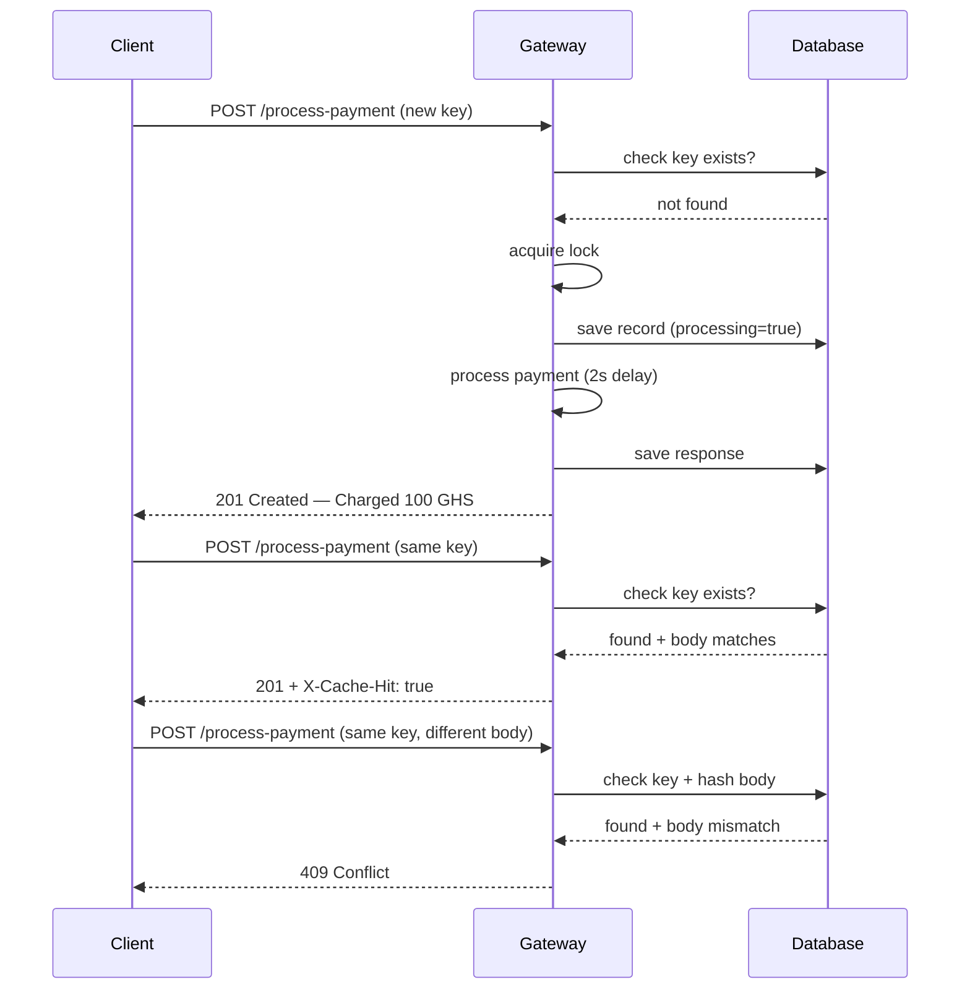

# Idempotency Gateway

A Django REST API that ensures payment requests are processed exactly once, no matter how many times they are retried.

Architecture Diagram
Sequence Diagram
mermaid
sequenceDiagram
    participant C as Client
    participant G as Gateway
    participant DB as Database

    C->>G: POST /process-payment (new key)
    G->>DB: check key exists?
    DB-->>G: not found
    G->>G: acquire lock
    G->>DB: save record (processing=true)
    G->>G: process payment (2s delay)
    G->>DB: save response
    G-->>C: 201 Created — Charged 100 GHS

    C->>G: POST /process-payment (same key)
    G->>DB: check key exists?
    DB-->>G: found + body matches
    G-->>C: 201 + X-Cache-Hit: true

    C->>G: POST /process-payment (same key, different body)
    G->>DB: check key + hash body
    DB-->>G: found + body mismatch
    G-->>C: 409 Conflict


Setup Instructions

1. Clone the repository
```bash
git clone https://github.com/MugishaJoshua/AmaliTech-DEG-Project-based-challenges
cd AmaliTech-DEG-Project-based-challenges
```

2. Create and activate virtual environment
```bash
python -m venv venv
source venv/bin/activate  # On Windows: venv\Scripts\activate
```

3. Install dependencies
```bash
pip install -r requirements.txt
```

4. Run migrations
```bash
cd idempotency_gateway
python manage.py migrate
```

5. Start the server
```bash
python manage.py runserver
```

 API Documentation

 POST /process-payment

Process a payment request with idempotency protection.

Headers
| Header | Required | Description |
|--------|----------|-------------|
| Content-Type | Yes | application/json |
| Idempotency-Key | Yes | Unique string per payment attempt |

Request Body
```json
{
  "amount": 100,
  "currency": "GHS"
}
```

Responses

| Scenario | Status Code | Response |
|----------|-------------|----------|
| First request | 201 Created | `{"status": "Success", "message": "Charged 100 GHS"}` |
| Duplicate request | 201 Created | Same response + `X-Cache-Hit: true` header |
| Same key, different body | 409 Conflict | `{"error": "Idempotency key already used for a different request body"}` |
| Missing key header | 400 Bad Request | `{"error": "Idempotency-Key header is required."}` |

Example Request
powershell
Invoke-WebRequest -Uri "http://127.0.0.1:8000/process-payment" `
  -Method POST `
  -Headers @{"Content-Type"="application/json"; "Idempotency-Key"="unique-key-001"} `
  -Body '{"amount": 100, "currency": "GHS"}'
```

## Design Decisions

SQLite — chosen for simplicity and zero configuration. Suitable for this project scope.

Threading Locks — used to handle race conditions where two identical requests arrive simultaneously. Each idempotency key gets its own lock so only one request can process at a time per key.

Body Hashing — the request body is hashed using SHA-256 before storing. This allows efficient comparison to detect if someone reuses a key with a different payload.

## Developer's Choice: 24hr Key Expiry

Idempotency keys automatically expire after 24 hours. This means:
- The database doesn't accumulate st# Idempotency Gateway

A RESTful API built with Django and Django REST Framework that ensures payment requests are processed exactly once, no matter how many times they are retried. Built for FinSafe Transactions Ltd. to solve the double-charging problem.

---

## Architecture Diagram

### Sequence Diagram



### Visual Flow


---

## Setup Instructions

1. Clone the repository
```bash
git clone https://github.com/MugishaJoshua/AmaliTech-DEG-Project-based-challenges
cd AmaliTech-DEG-Project-based-challenges
```

2. Create and activate virtual environment
```bash
python -m venv venv
source venv/bin/activate  # On Windows: venv\Scripts\activate
```

3. Install dependencies
```bash
pip install -r requirements.txt
```

4. Run migrations
```bash
cd idempotency_gateway
python manage.py migrate
```

5. Start the server
```bash
python manage.py runserver
```

---

## API Documentation

### POST /process-payment

Process a payment request with idempotency protection.

**Headers**

| Header | Required | Description |
|--------|----------|-------------|
| Content-Type | Yes | application/json |
| Idempotency-Key | Yes | Unique string per payment attempt |

**Request Body**
```json
{
  "amount": 100,
  "currency": "GHS"
}
```

**Responses**

| Scenario | Status Code | Response |
|----------|-------------|----------|
| First request | 201 Created | `{"status": "Success", "message": "Charged 100 GHS"}` |
| Duplicate request | 201 Created | Same response + `X-Cache-Hit: true` header |
| Same key, different body | 409 Conflict | `{"error": "Idempotency key already used for a different request body"}` |
| Missing Idempotency-Key | 400 Bad Request | `{"error": "Idempotency-Key header is required."}` |
| Missing amount or currency | 400 Bad Request | `{"error": "Request body must contain amount and currency."}` |

**Example Request (Windows PowerShell)**
```powershell
Invoke-WebRequest -Uri "http://127.0.0.1:8000/process-payment" `
  -Method POST `
  -Headers @{"Content-Type"="application/json"; "Idempotency-Key"="unique-key-001"} `
  -Body '{"amount": 100, "currency": "GHS"}'
```

**Example Request (Linux/Mac)**
```bash
curl -X POST http://127.0.0.1:8000/process-payment \
  -H "Content-Type: application/json" \
  -H "Idempotency-Key: unique-key-001" \
  -d '{"amount": 100, "currency": "GHS"}'
```

---

## Design Decisions

**SQLite** — chosen for simplicity and zero configuration. No extra setup needed when cloning the project.

**Threading Locks** — each idempotency key gets its own lock so only one request can process at a time per key. This prevents race conditions where two identical requests arrive simultaneously and both get processed.

**SHA-256 Body Hashing** — the request body is hashed before storing. This allows fast and reliable comparison to detect if someone reuses a key with a different payload.

**Service Layer** — all business logic lives in `services.py` and is kept separate from `views.py`. This makes the code clean, readable and easy to test.

---

## Developer's Choice: 24hr Key Expiry

Idempotency keys automatically expire after **24 hours**. This means:

- The database does not accumulate stale keys forever
- After 24 hours, the same key can be reused for a new payment
- This matches how real fintech companies like Stripe handle idempotency

This was added because in a real payment system, retries only happen within a short window after the original request. Keeping keys forever wastes storage and creates unnecessary security risk.ale keys forever
- After 24 hours, the same key can be reused for a new payment
- This matches how real Fintech companies like Stripe handle idempotency

This was chosen because in a real payment system, retries only happen within a short window after the original request. Keeping keys forever wastes storage and creates unnecessary risk.